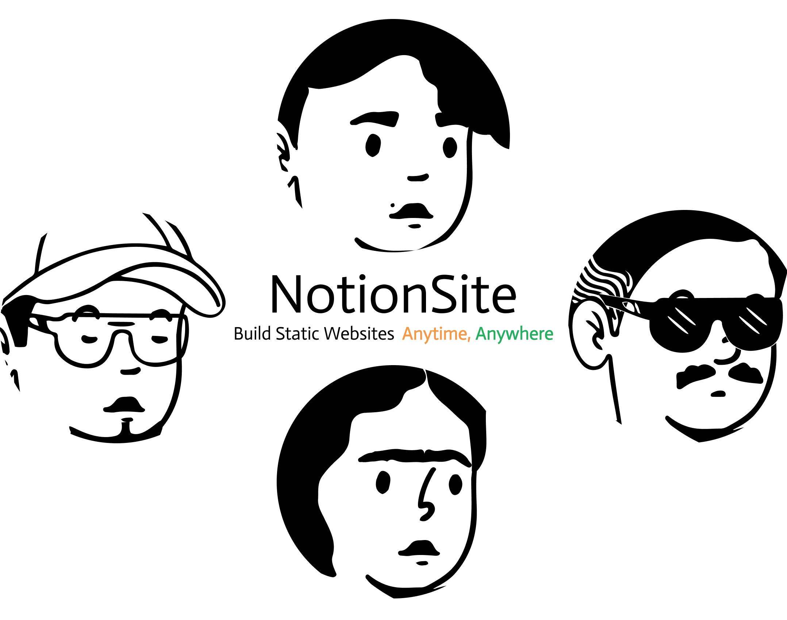




# 让你的 Notion 与网页联动起来
 ***Notion Site*** 是基于 **[Notion](https://www.notion.so/)** 和 **[Hugo](https://gohugo.io/)** 深度绑定的一款定制化网站的开源软件，您可以在 Hugo 模板商店的数百个模板中找到喜欢的模板作为您的博客或文档站。

<!--more-->
通过 **[Vercel](https://vercel.com/)** 与 **[Github Action](https://docs.github.com/en/actions)** 的能力，只需要一次配置，随时随地使用任何设备进行编辑。



如果您是开发者，欢迎提供宝贵的 ***[PR](https://github.com/pkwenda/notion-site/pulls)*** 或 ***[ISSUE](https://github.com/pkwenda/notion-site/issues)*** 。













