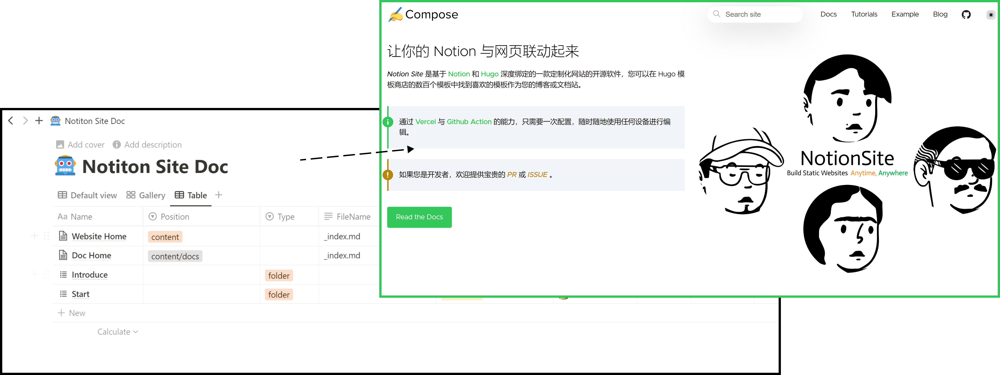
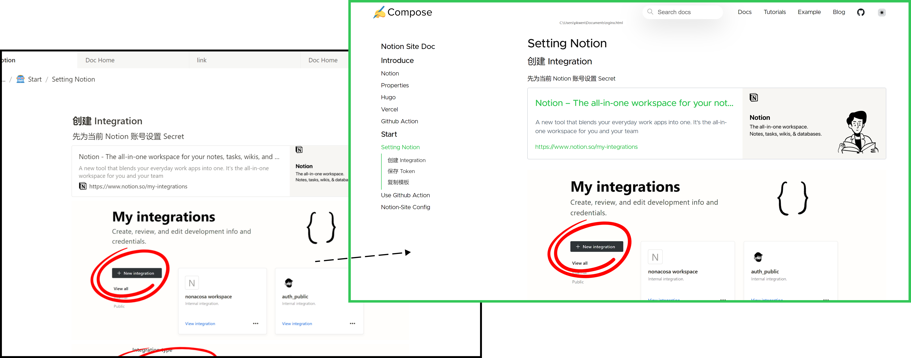
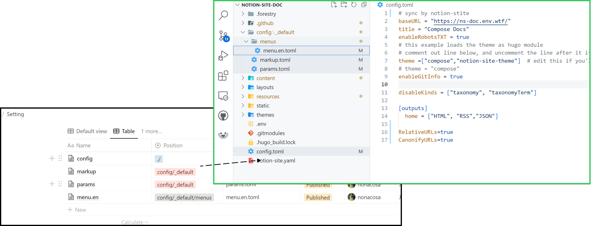

 ***[Notion-Site](https://github.com/pkwenda/notion-site)*** 是一个打通 ***[Notion](https://www.notion.so/)*** 与 ***[Hugo ](https://gohugo.io/)*** 的自动建站工具，它比 Notion 默认提供的 Share 功能更适用于构建网站，我们可以使用 Hugo 提供的 200 多种类型的主题创建我们的网站。

基于 **Notion-Site** ，就像使用 ***[IFTTT](https://ifttt.com/)*** 一样，只需要一次配置之后，无需服务器资源就可以在任何设备的 **Notion** 中以维护文章的方式来管理、构建网站。

<!--more-->

 **Notion 清晰的目录结构** 

 **Notion 对网页的转义** 

 **Notion 对网站配置文件的云储存** 

### Notion 本身做为博客的不足：
Notion 因为自带分享链接，所以近几年我们通常直接分享 Notion 的地址作为我们的博客、文档站，或者使用类似 ***[Notion-Blog](/3dab2163acdb415aaf6514b3c00368c5)*** 等开源方案做 1:1 的转换。

也可以在 **[Cloudflare Web Worker](https://developers.cloudflare.com/dns/zone-setups/full-setup/setup)** 提供的能力绑定域名、CDN 提速等等：

{{< bookmark image="https://res.cloudinary.com/practicaldev/image/fetch/s--9mAvnDqk--/c_imagga_scale,f_auto,fl_progressive,h_500,q_auto,w_1000/https://dev-to-uploads.s3.amazonaws.com/uploads/articles/pnivzp4qvskmpr5ppk4f.png" icon="https://res.cloudinary.com/practicaldev/image/fetch/s--lrmEcD2H--/c_limit,f_png,fl_progressive,q_80,w_128/https://practicaldev-herokuapp-com.freetls.fastly.net/assets/devlogo-pwa-512.png" url="https://dev.to/koddr/using-the-notion-page-as-a-personal-website-with-your-domain-on-cloudflare-1pi7"  des="Introduction   Hi, DEV people! 🙂 Today, I give you a handy step-by-step guide to help you..."  title="🌐 Using the Notion page as a personal website with your domain on Cloudflare"  >}}

在希望实现上面的需求的同时，保留 **[Notion](https://www.notion.so/)** 的便利性，与 ***[Hugo](https://gohugo.io/)*** 的垂直性，开发了 Notion-Site：

| 产品 | RSS | 速度 | 备份 | 部署 | 移动端 |
| --- | --- | --- | --- | --- | --- |
| Notion | `❌` | `❌` | `✔` | `✔` | `✔` |
| Hugo | `✔` | `✔` | `❌` | `❌` | `❌` |
| Notion-Site | `✔` | `✔` | `✔` | `✔` | `✔` |
<!--more-->



我们要做的只是在 Notion 中编辑文章即可。 **只需要一次配置实现** ：

- 备份： **Notion 、 Github Repository** 

- 自动化 ： **Github Action** 

- 网站部署： **Vercel** 



### Notion-Site 构建流程


graph TD
    A[Notion DataBase] -->|Notion-Site| B(Get Pages)
    B --> C{Process Pages To Hugo}
    C -->|setting| D[Hugo Setting Files]
    C -->|Article| E[Hugo Content Files]
    E -->|Folder| G[Folder]
    E -->|Article| H[Markdown files]
    E -->|Media| I[Downlaod Meida files]



graph TD
   
    Hugo -->|CI| J[GitHub ACtion] --> Vercel --> DPD[Complete the deployment]


