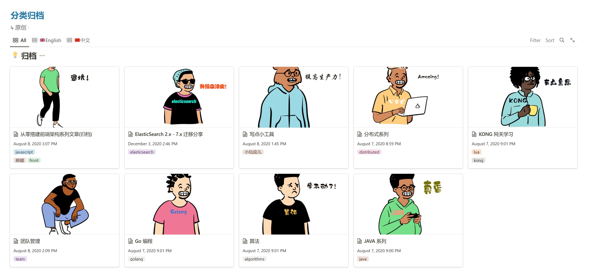

Notion 因为自带分享链接，所以近几年我们通常直接分享 Notion 的地址作为我们的博客、文档站，或者使用类似 **_[Notion-Blog](/3dab2163acdb415aaf6514b3c00368c5)_** 等开源方案做 1:1 的转换。

也可以在 **[Cloudflare Web Worker](https://developers.cloudflare.com/dns/zone-setups/full-setup/setup)** 提供的能力绑定域名、CDN 提速等等：

<!--more-->- [using-the-notion-page-as-a-personal-website-with-your-domain-on-cloudflare](https://dev.to/koddr/using-the-notion-page-as-a-personal-website-with-your-domain-on-cloudflare-1pi7)

**博客示例** ：[https://zhuangwenda.notion.site/73909416ef114124adb89f9c56275561](https://zhuangwenda.notion.site/73909416ef114124adb89f9c56275561)



**Notion 制作的博客方便编辑，但是相比传统博客始终有几点问题无法解决：**



- 没有 RSS 订阅

- 加载的 notion 资源太多，打开文章较慢

- 中国大陆访问速度慢

- 文章链接太长，如想缩短需要针对每个文章使用 **[Cloudflare Web Worker](https://developers.cloudflare.com/dns/zone-setups/full-setup/setup)** 做映射

- 缺失很多博客的要素：时间轴、分类、标签，更像是笔记

- 只有 Notion 的风格，主题样式太单一，无法定制化

当然，如果能接受上面的缺点，Notion Blog 是最方便的选择。



如果使用传统博客的方式，也同样有不足：



- Hugo 类的平台很多 shortcodes需要记忆语法，手动转义，在 MD 编辑器中不伦不类

- 需要自己实现备份

- WordPress Nginx 等方式需要购买资源或主题

- 每次部署需要手动触发，需要维护一些命令或脚本

- Hugo 很难用任何设备（手机，平板）维护网站文章

在希望实现上面的需求的同时，保留 Notion 的便利性，与 Hugo 平台深度绑定，开发了 Notion-Site。

### 流程图


graph TD
A[Notion DataBase] -->|Notion-Site| B(Get Pages)
B --> C{Process Pages To Hugo}
C -->|setting| D[Hugo Setting Files]
C -->|Article| E[Hugo Content Files]
E -->|Folder| G[Folder]
E -->|Article| H[Markdown files]
E -->|Media| I[Downlaod Meida files]



graph TD

    Hugo -->|CI| J[GitHub ACtion] --> Vercel --> DPD[Complete the deployment]





我们要做的只是在 Notion 中编辑文章即可。



只需要一次配置，可以实现：

- **备份交给 Notion 、 Github Repository**

- **自动化交给 ： Github Action**

- **自动部署交给：Vercel**
