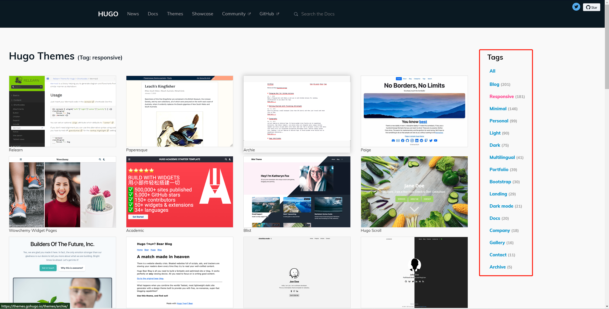
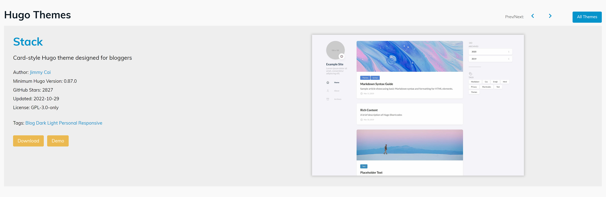
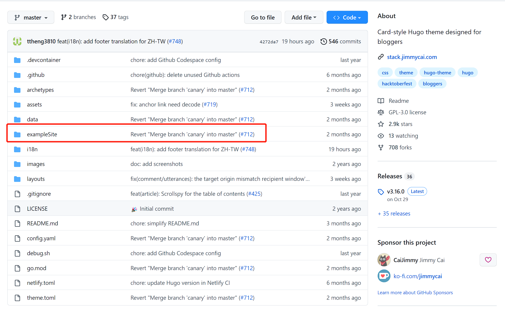
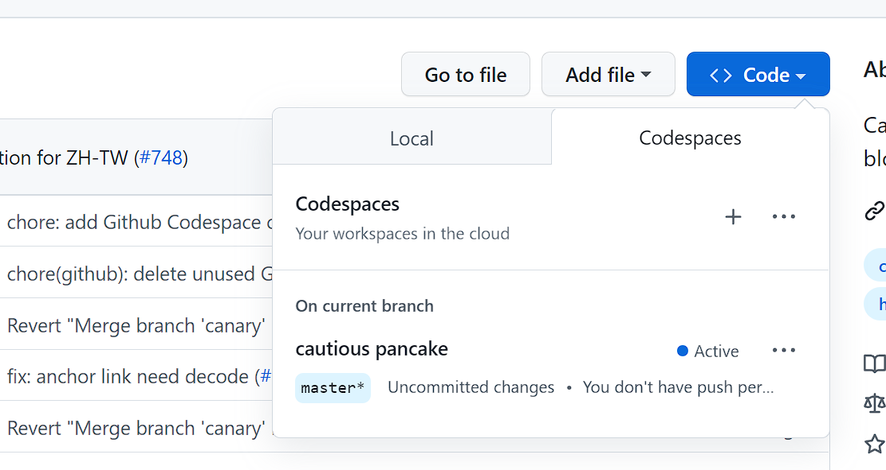
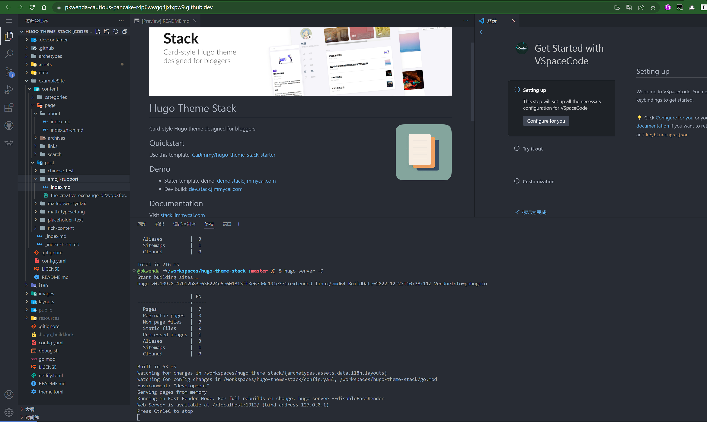

目前常见的开源 markdown > html 的静态网站方案有以下几种：

-  **Hugo** 

<!--more-->-  **Jekyll** 

-  **Hexo** 

-  **VuePress** 

- ……

等等优秀的项目，基于社区完善程度、模板的数量、编程语言、未来的拓展性考虑，目前 Notion-Site 绑定了 Hugo。

### 主题商店
目前 Hugo 官方收集的主题：[https://themes.gohugo.io/](https://themes.gohugo.io/)

在这个列表中的 200+ 主题都是比较成熟的。



也可以在 ***[Github 中搜索 hugo theme](https://github.com/search?o=desc&q=hugo+theme&s=updated&type=Repositories)*** 发现一些最近有哪些还没有被官方收集到的好玩的模板。



### 挑选模板

 **Step1：** 我们应该定位自己想要创建一个什么类型的网站：

- 个人博客

- 团队博客

- 摄影画廊

- 公司主页

- 个人简历

- 文档站

 **Step2：** 再去筛选哪些类型是我们的更高要求：

- 响应式

- 支持 Dark 模式

- 轻量

- 简洁

- 美观

以[Stack 模板](https://github.com/CaiJimmy/hugo-theme-stack)为例，进入主题，通常有两个按钮：

- download：直接跳转到 Github 仓库

- demo：打开示例网站预览

一定会有 download，demo（在线预览） 不一定全部都有，如果没有需要自己下载模板启动，直到我们选出自己想要的模板为止。

### 下载模板运行示例
点击 download 页面， **[跳转到 Github 仓库](https://github.com/CaiJimmy/hugo-theme-stack)**  **,** 下载仓库，每个模板都会有一个示例项目: exampleSite

也可以直接通过 Github 提供的 CodeSpaces 预览：

这就是模板开发者提供的模板，我们需要关注示例的内容结构，这决定了我们的 ：

- Position 应该设置在哪里

- 需要配置哪些配置文件

- FileName 的设置

- 模板里好玩的 shrotsCodes 语法应该如何书写

Notion-Site 只支持 Notion 自带的大部分功能：

- 视频

- 音频

- 文件

- 图片

- 嵌入网站

- twitter 预览

- PDF

- ….

关于内置的 shortCodes ，以及如何使用其他 shortCodes，请看后面的文档。

