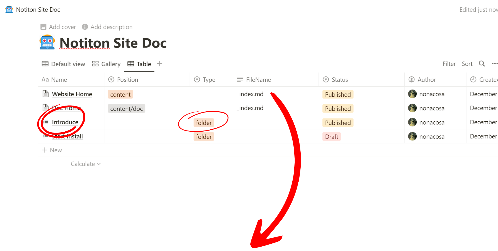
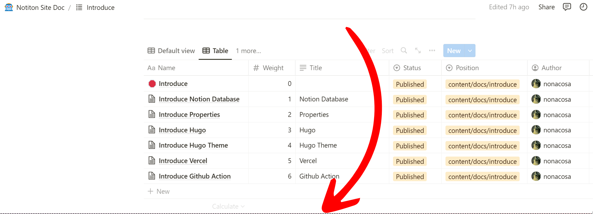
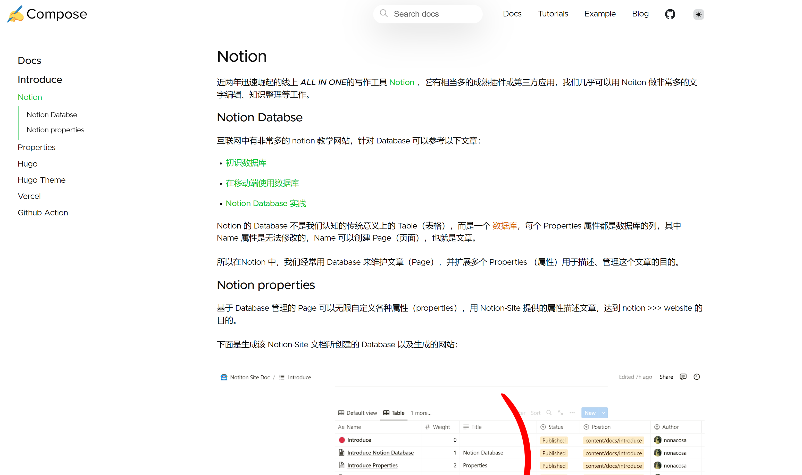
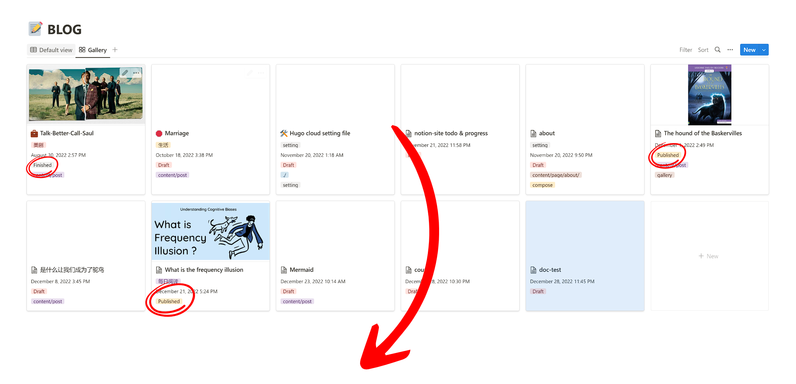
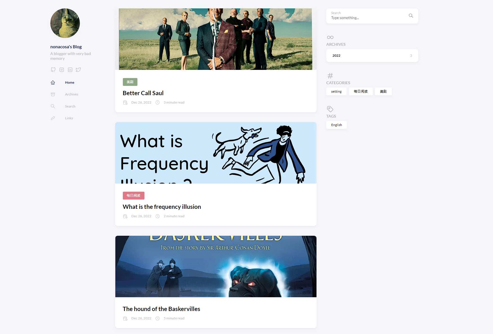

近两年迅速崛起的线上 *ALL IN ONE* 的写作工具 **[Notion](https://www.notion.so/)**  *，它* 有相当多的成熟插件或第三方应用，我们几乎可以用 Noiton 做非常多的文字编辑、知识整理等工作。

### Notion Databse：
<!--more-->互联网中有非常多的 notion 教学网站，针对 Database 可以参考以下文章：

-  **[初识数据库](https://notionchina.co/guide/databases/intro-to-databases.html)** 

-  **[在移动端使用数据库](https://notionchina.co/guide/databases/databases-on-mobile.html)** 

-  **[Notion Database 实践](https://linmi.cc/3373.html)** 

Notion 的 Database 不是我们认知的传统意义上的 Table（表格），而是一个 **数据库** ，每个 Properties 属性都是数据库的列，其中 Name 属性是无法修改的，Name 可以创建 Page（页面），也就是文章。



所以在Notion 中，我们经常用 Database 来维护文章（Page），并扩展多个 Properties （属性）用于描述、管理这个文章的目的。



### Notion properties：
基于 Database 管理的 Page 可以无限自定义各种属性（properties），用 Notion-Site 提供的属性描述文章，达到 notion >>> website 的目的。

### 示例：


 **下面是生成该 Notion-Site 文档所创建的 Database 以及效果：** 





 **下面是生成个人 Blog 网站创建的 Database 以及效果:** 



Notion 了解到这里，就已经可以使用 Notion 维护网站了。

