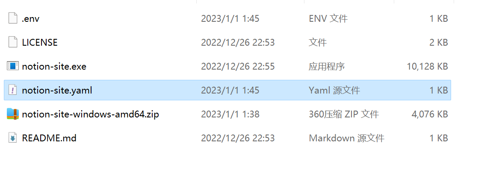

在实际生成网站之前，我们也可以在本地进行 debug 测试，测试生成的网站是否正确，缩短配置时间。

### 下载或安装 Notion-Site 离线程序
<!--more-->1： 在 **[release 下载页](https://github.com/pkwenda/notion-site/releases)** 选择当前操作系统最新的 release 二进制包。

2： 基于 **Unix 平台** 可以在线安装：


 ```powershell
 curl -sSf https://raw.githubusercontent.com/pkwenda/notion-site/master/install.sh | sh
 ```
 

### 生成配置文件：
在 windows 中：


 ```powershell
 notion-site.exe init
 ```
 



在 Unix 系统中：


 ```powershell
 notion-site init
 ```
 生成如下文件：

notion-site.yaml


 ```yaml
 notion:
    databaseId: YOUR-NOTION-DATABASE-ID
markdown:
  homePath: ""
 ```
 我们需要更改：

- homePath: 为<span style="color: rgba(212, 76, 71, 1);">执行命令时 hugo 目录的相对路径</span>

- databaseId 换为 复制模板后自己 workspace 页面的 page id：


.env


 ```yaml
 NOTION_SECRET=xxxx
 ```
  **Notion_SECRET** 填写之前我们创建的 **Integration** 的<span style="color: rgba(212, 76, 71, 1);"> **Token** </span>，用 .env 文件来代替前文 **Githun Action** 的 **secret** 环境变量配置。


### 下载 Hugo 模板
这里有两点需要注意：

- 1：所有的主题放在 themes，通常 **[示例](https://github.com/pkwenda/notion-site-doc/tree/main/themes)** 都是使用 ***[Git Submodules](https://git-scm.com/book/en/v2/Git-Tools-Submodules)*** 同步的主题仓库，但不强制。

- 2：注意配置文件的主题配置👇



不管使用那种主题，都需要添加并使用 ***[notion-site-shortcodes](https://github.com/pkwenda/notion-site-shortcodes)*** 模板作为基础模板，该模板提供了 notion 中的非 markdown 类型的 shortcodes 转换。如不添加此模板，notion 中很多类型无法同步：

- youtube

- twitter

- gist

- ….


### Debug


 ```powershell
 ./notion-site

Load .env file
Using config file: D:\code\nonacosa\golang\notion_awesome\notion-site\notion-site.yaml
✔ Querying Notion database: Completed
-- Article [1/5] -- https://www.notion.so/Setting-ab95db6fcd37450ca19c17e0c3fa99d9 
✔ Getting blocks tree: Completed
✔ Generating blog post: Completed
-- Article [2/5] -- https://www.notion.so/Doc-Home-3dab2163acdb415aaf6514b3c00368c5 
✔ Getting blocks tree: Completed
Processing the 0 th *notion.ParagraphBlock tpye block  -> 84ec2a40-bb04-443a-8e1e-1e66379be280
...
Processing the 22 th *notion.BulletedListItemBlock tpye block  -> 16478784-72cc-4f4e-8362-8344235ead44
Processing the 23 th *notion.ParagraphBlock tpye block  -> 44780147-3a79-411f-8f75-b6a667af1d12
✔ Generating blog post: Completed
 ```
 


注意：如果 notion 中含有 twitter 或 bookmark 等指向被 GFW 屏蔽的网址，本地调试时需要开启代理。




然后安装运行 Hugo，查看本地效果即可：


 ```powershell
 hugo server -D
 ```
 打开[http://localhost:1313](http://localhost:1313)查看效果

