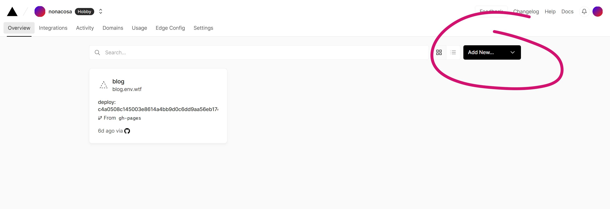
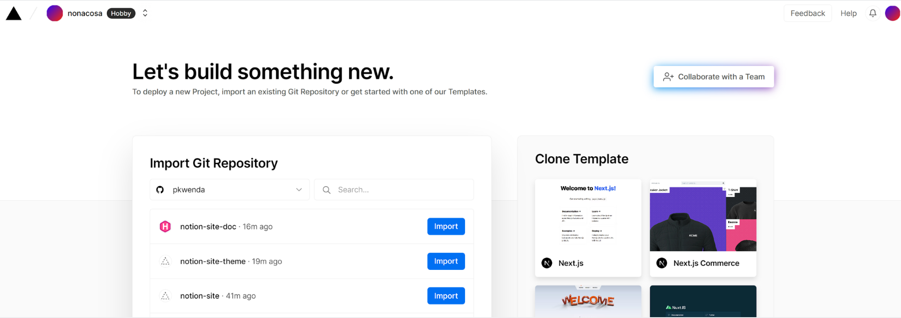
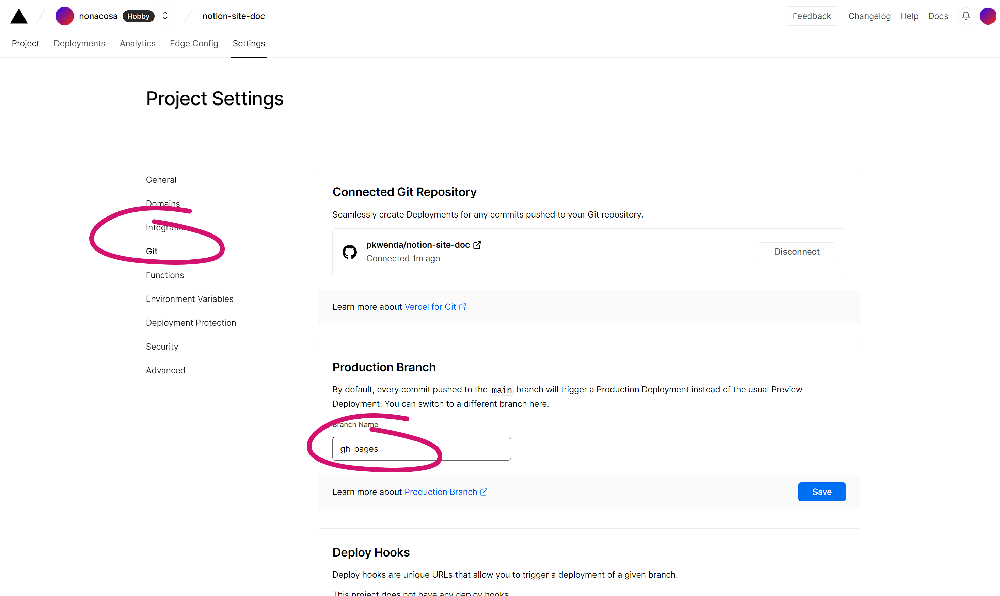
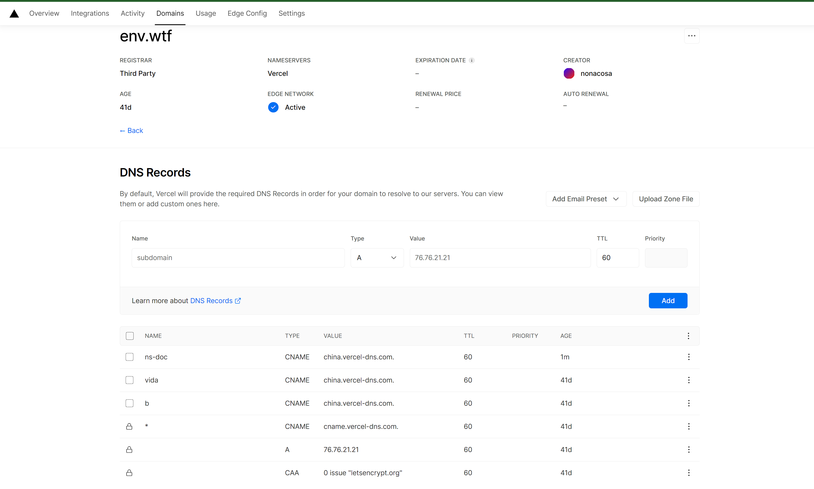
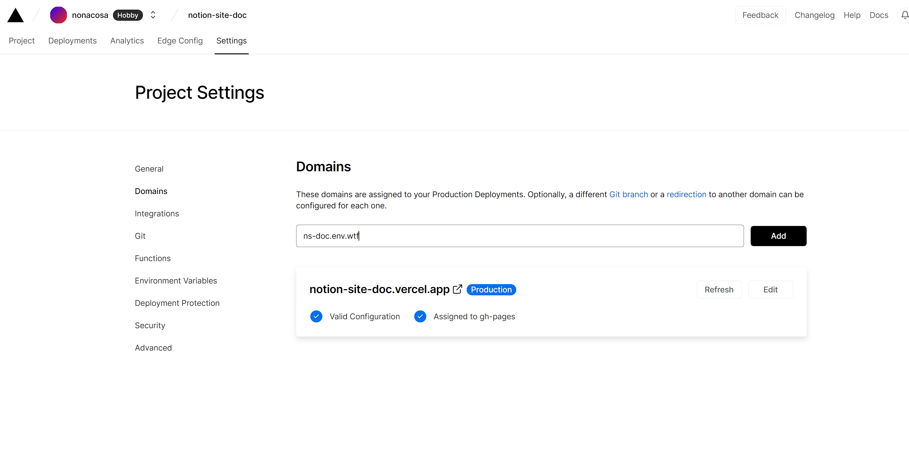
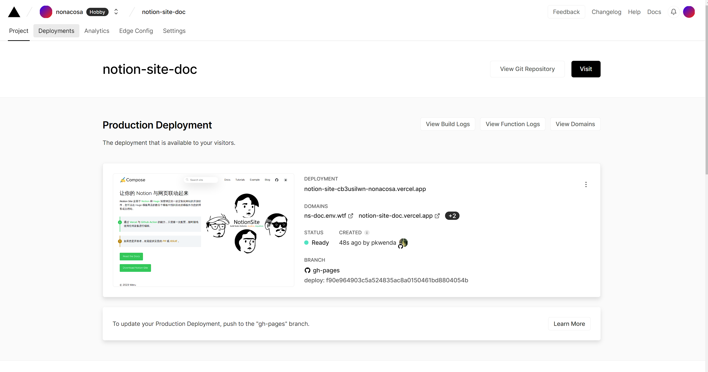

 **首先，需要创建一个 Vercel 账号，然后添加新项目** 

<!--more-->

 **授权 Github ， 选择之前基于 Notion-Site-Doc 创建的新仓库，点击 Import** 

 **创建后修改分支 main 为 gh-pages  :** 

 **如果有自己的域名，绑定到中国区的 Host 并设置子域名即可** 

在 Github Action  手动重新运行一下（第一次构建默认是 main 分支，修改为 gh-pages 分支后需要再触发一下 Vercel 的 Hook）

### 完成
如果不更换主题，以后都不需要再配置了。

