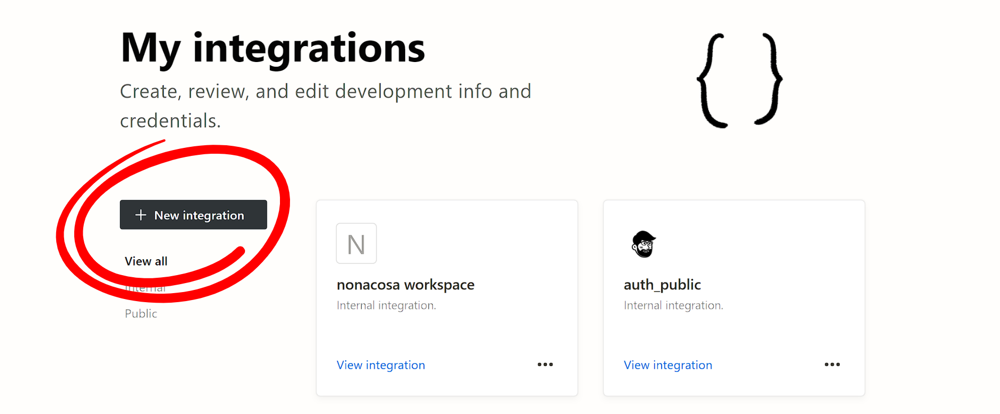
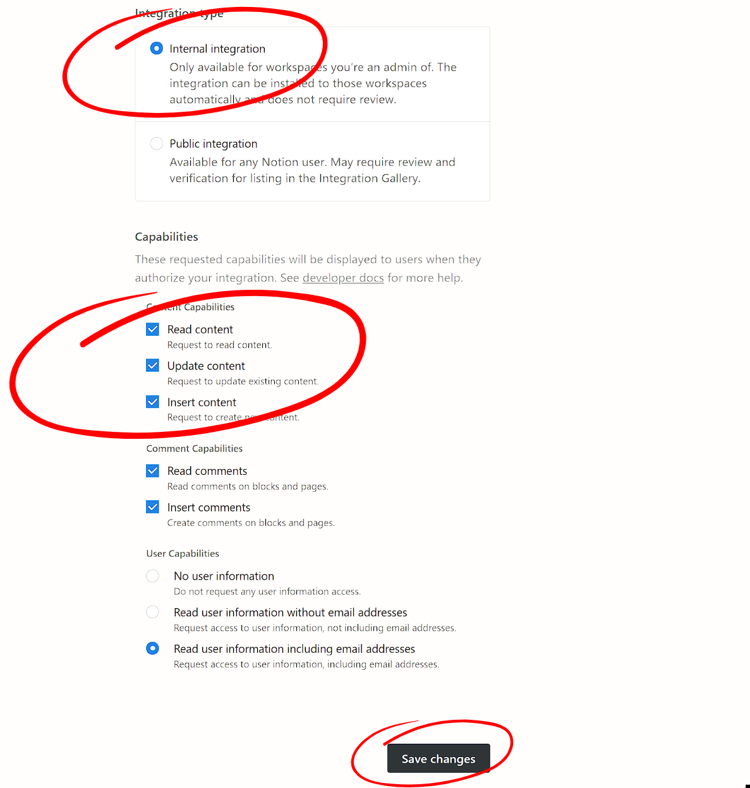
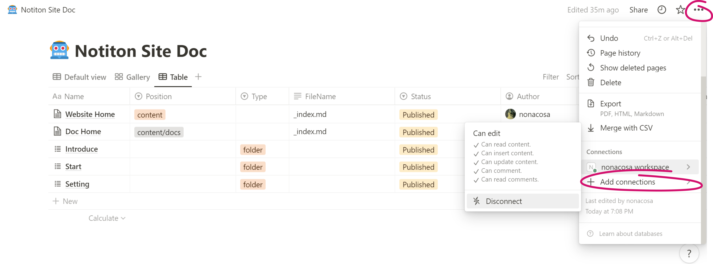
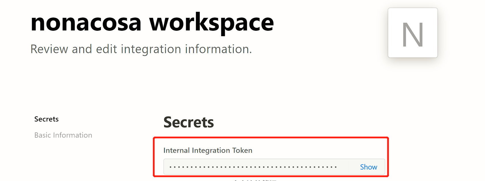
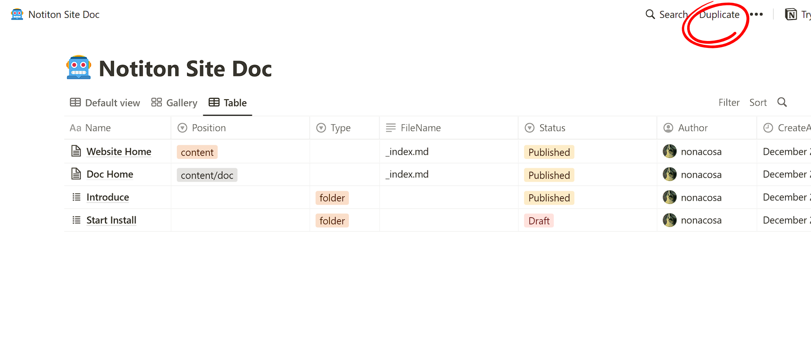

### 创建 Integration
先为当前 Notion 账号设置 Secret



<!--more-->

然后勾选 Internal integration, 并勾选三个权限：

- read

- update

- insert （可选）



read 权限是为了读取 Page 信息，update 权限是为了自动更新 Page 属性，insert 权限可以为了以后 Notion-Site 的新功能做准备。



### 添加 Integration

### 保存 Token

进入刚刚创建的 Notion Integration，拿到 token，该 token 的生效范围是该账号的 workspace，不同的 workspace 需要不同的  Integration

### 复制模板

博客类 Notion 模板：[BLOG](https://www.notion.so/df7fb0e4e0114268b973f9d3e9a39982)

文档类 Notion 模板：[Notiton Site Doc](https://www.notion.so/2bd00e5dfff3449ba81e0142f8af9bbb)

选择类型后，点击复制，选择复制到自己的 workspace 即可。

