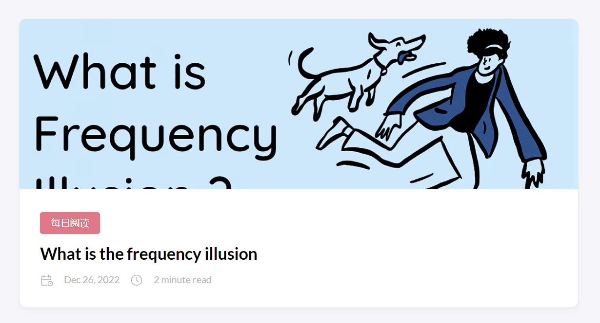
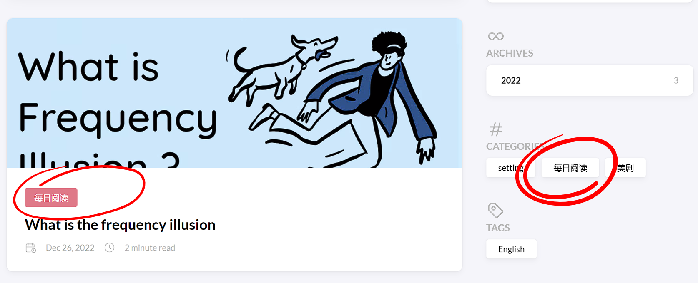
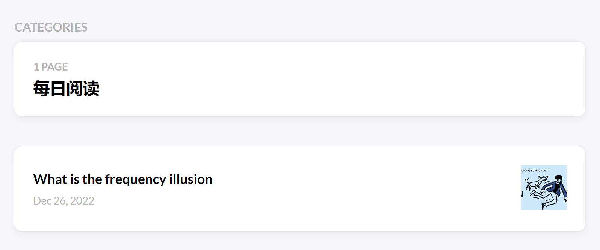
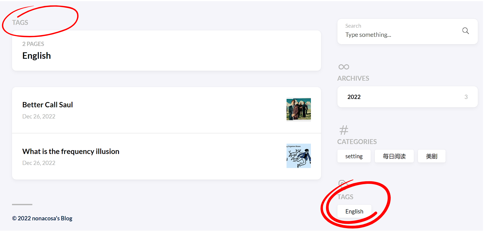
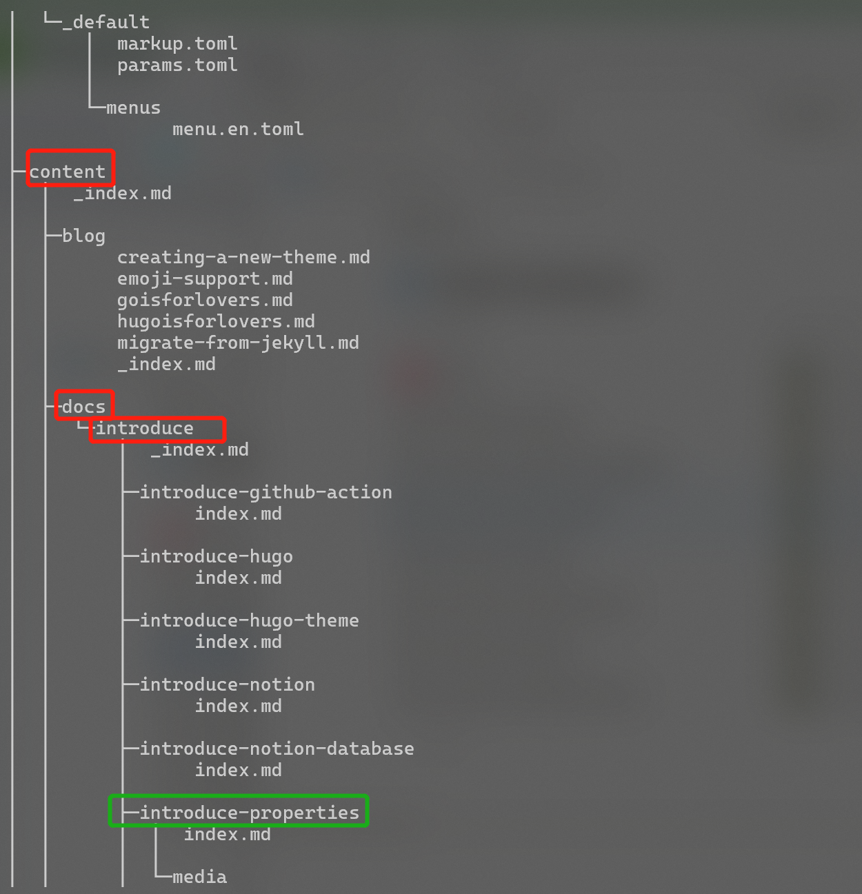
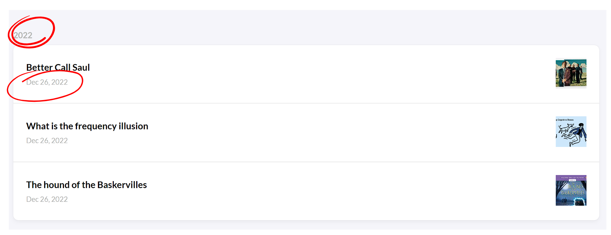
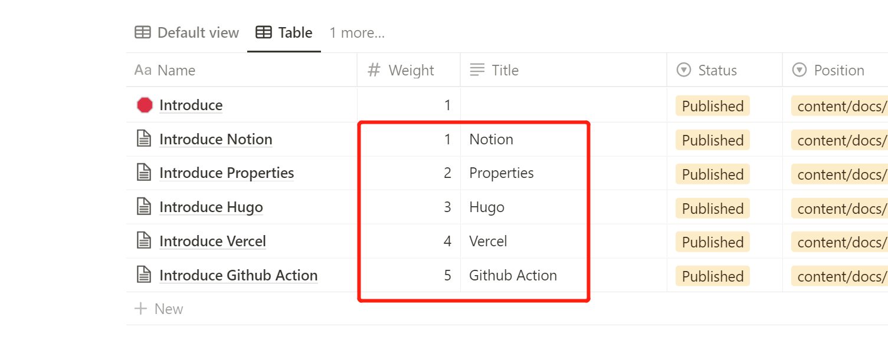
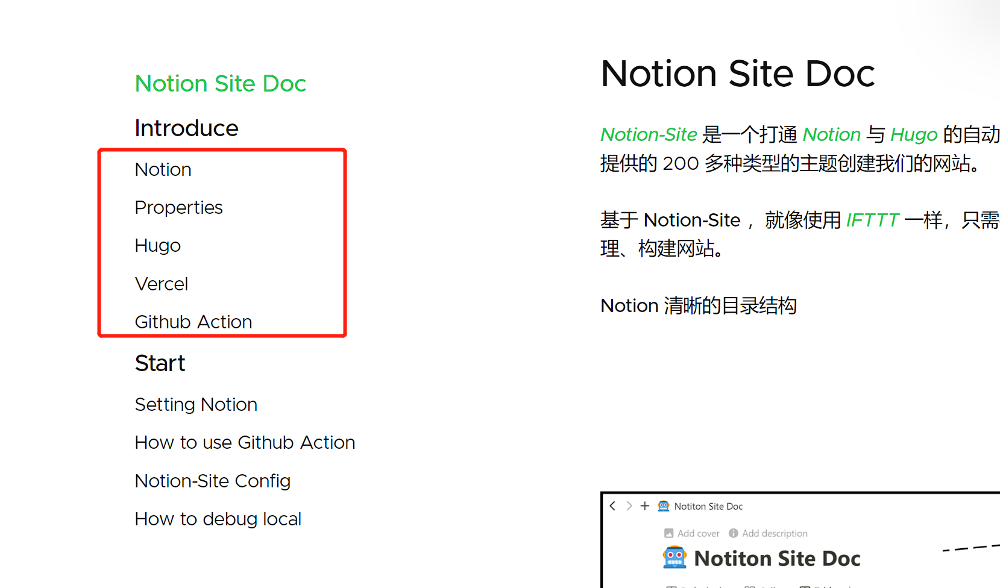

 **Notion** 的属性是可以完全自己定制的，但是在 **Notion-Site** 中，我们绑定了一些生成网站所必要的属性，这些属性是 Notion-Site 的核心功能，每个属性都用于管理生成的网站，所以，为了以后随时随地管理网站，需要先理解这些属性的意义和规则。



<!--more-->Notion-Site 的属性非常重要，本页内容请一定仔细阅读。当然如果你非常了解 Hugo，浅浅的浏览一遍就好。



### Name
Database 中的默认字段，用作维护网站的子页面，名称作为描述字段，让网站管理人员理解这个页面的作用，通常 Title 属性作为文章实际的标题，但是如果未填写 Title 属性，则使用 Name 属性作为文章的标题。

### Cover
Database 中的隐藏字段，用作维护网站文章的封面，表示首页的缩略图：

### Title


标题属性，大多数所有主题都默认支持该属性，用来维护文章或文档的标题



### Status
用于管理博客的发布状态，目前有以下几种状态：

-  **finished** 

-  **published** 

-  **draft** 

如果设置该状态是 draft，表示该文章还处于“草稿” 阶段，那么 Notion-Site 不会拉取该页面，也不会参与生成网站。

如果设置该状态是 finished 或 published ，那么 Notion-Site 会从 Notion 服务器拉取该页面，生成目标网页

当网站发布完毕，Notion-Site 会将 finished 状态自动修改为 published 状态，用户可以很方便的看到变化。

### Categories


分类属性，大多数博客类主题都默认支持该属性，方便查看分类的文章或浏览该分类的所有文章。



### Tags


标签属性，大多数博客类主题都默认支持该属性，方便查看标签的文章或浏览该标签的所有文章。



### Position

非必填，如果未填写，Notion-Site 初始化默认值为`"content/post"`





因为各种主题的用途不同，所以每种主题可能有自己的存放 markdown 原文的路径，用户可以根据自己的需求选择 Notion-Site 生成文件的位置,该路径是以 HomePath 为基础的相对路径



### Keywords
一些模板有支持

### FileName
为生成的文件自定义文件名，默认生成的规则:`{homePath} / {Position} / {Name} / index.md`



但是如果填写了 FileName 属性，将会按照`{homePath} / {position} / {FileName}.md`规则创建文件



### Desctiption
文章的描述信息

### CreateAt
创建时间属性，大多数博客类主题都默认支持该属性，方便按照年度查看归档的文章，文章的发布时间，以及排序。



该字段会影响生成网站中文章的发布时间，在 Notion-Site 提供的 Database 默认模板中，时间是默认不可编辑的，如果用户想自定义创建时间，例如迁移一些旧文章等，可以修改 CreateAt 的属性改为自定义，由自己调整时间。



### Author
保留字段，暂时没用

### LastMod
上次修改时间属性，部分博客类主题默认支持该属性。

### ExpiryDate
过期时间属性，大多数博客类主题都默认支持该属性，如果 当前时间 > 过期时间，该文章不可见。

### PublishDate
该文章最近一次的部署时间，为 Notion-Site 成功发布该文章的时间，由 Notion-Site 程序自动修改。

### Show_comments
是否显示评论，暂未接入评论组件，TODO

### Slug
自定义文章 URL 属性，大多数博客类主题都默认支持该属性，如果文章含有中文导致链接不美观或名称太长，可以设置该属性，将自动替换 Name 属性作为访问地址。

### Type
-  **setting** 

-  **gallery** 

-  **folder** 

-  **compose** 

 **setting** 表示该 Page 里面的内容为配置信息，比如 config.yaml，只会原样输出，并且不会生成任何额外的 FrontMatter 描述信息。

 **folder** 表示该 Page 只是一个目录，里面包含子 Database , 一般用于文档站的维护，方便在 Notion 中体现层次，方便管理，通常我们只需要设置 folder 的页面 status 属性为 draf，那么整个目录都不会被 Notion-Site 下载参与构建网站。

 **gallery** 表示该文章开启 “画廊模式”，针对三张以上连续的图片会在文章内部合并为一个 Gallery，比较适合图片类的博客。

### Weight
权重属性，大多数文档类主题都默认支持该属性，方便按照为一个目录下的文档定制排序。

