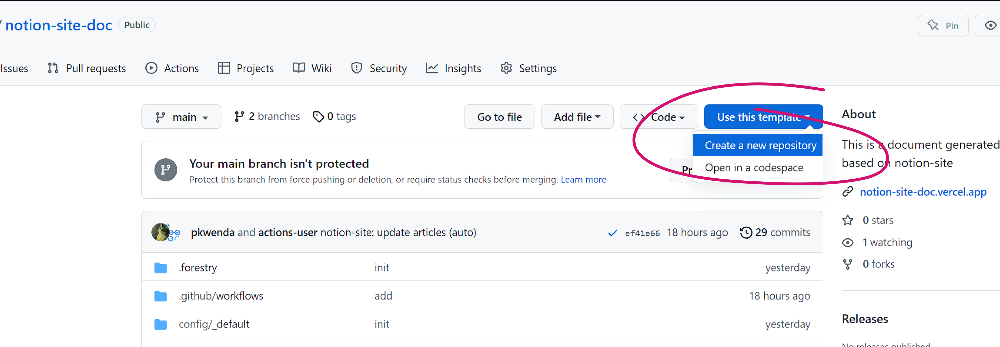
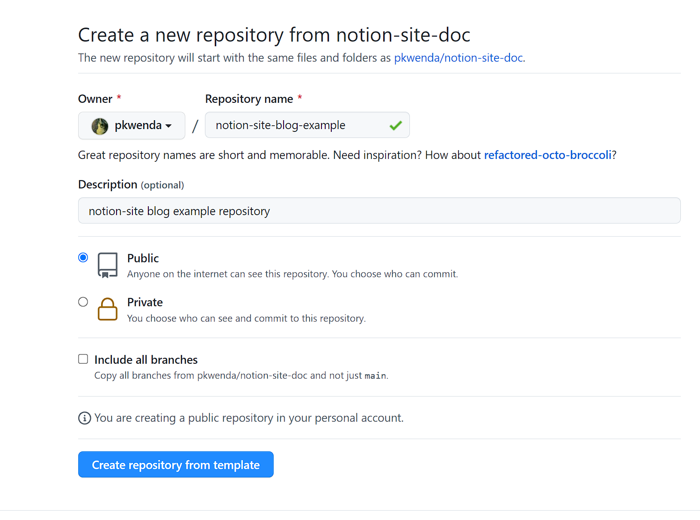
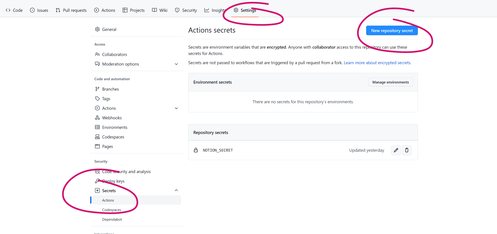
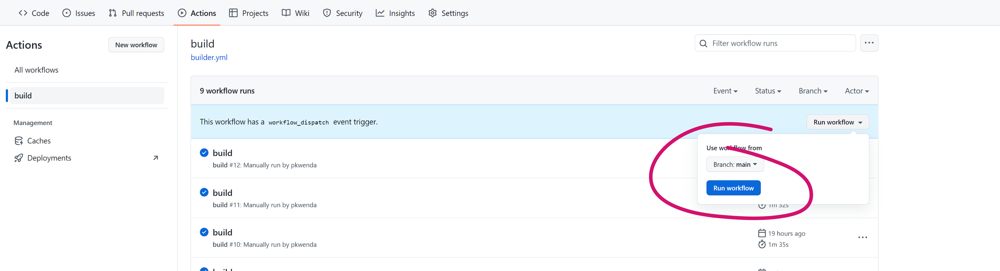
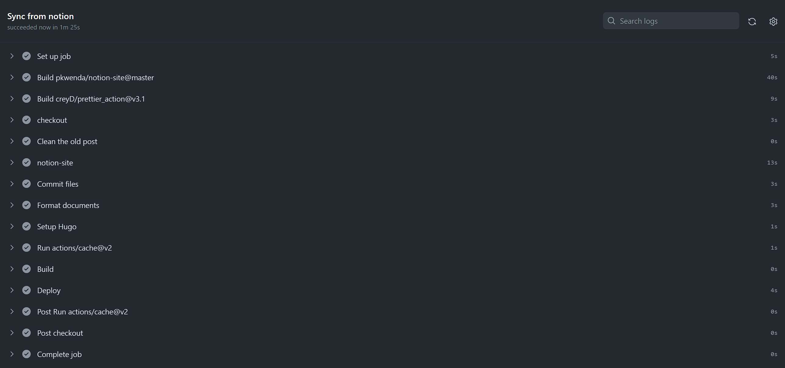
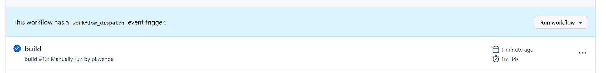

我们可以在 **[Github 商店](https://github.com/marketplace)** 中找到 **[Notion-Site](https://github.com/marketplace/actions/notion-site)**  **，** 就可以在 **Github** 中随意使用了，代码如下：


 ```yaml
 - name: notion-site
  uses: pkwenda/notion-site@v1.0.3
 ```
 <!--more-->为了节省时间，Notion-Site 已经创建好了一套默认流程，可以直接使用：



直接在该库中直接点击： **use the template** 创建自己的仓库即可：





 **新建仓库：** 



然后为了隐式存储我们的<span style="color: rgba(212, 76, 71, 1);"> ***Token*** </span>，防止其他用户看到<span style="color: rgba(212, 76, 71, 1);"> ***Token*** </span>，需要在该仓库创建环境变量：




然后我们可以手动点击 Build 部署，或者等待默认的的自动部署，具体看之前介绍的 cron 配置，当然，可以随意设置自己仓库的自动部署频率，<span style="background-color: rgba(251, 236, 221, 1);">私有库注意前文介绍的费用问题。</span>






可以看到 花费 90 秒左右顺利部署完成，服务器费用由微软提供。





注意： ***[notion-site-doc](https://github.com/pkwenda/notion-site-doc)*** 仓库绑定的默认主题是： ***[Compose](https://github.com/onweru/compose)*** 文档类主题，如果想使用其他主题，请参阅：更换主题



- 创建 **ubuntu** 容器

- 设置每天执行一次

- 拉取本仓库代码（并递归下载 sub model 主题）

- 拉取 ***[notion-site](https://github.com/pkwenda/notion-site-doc)*** 最新版本

- 清空上次拉取的 Page

- 从 Notion 拉取最新的 Page

- 提交保存最新的 Page >> markdown 原文，提交到本仓库做为备份

- 使用 Hugo 进行编译，将生成的网站提交到 ***[gh-pages 分支](https://github.com/pkwenda/notion-site-doc/tree/gh-pages)*** 

以上所有的配置用户可以根据自己的需求自行调整，参考 Github Action 文档：

{{< bookmark image="https://github.githubassets.com/images/modules/open_graph/github-logo.png" icon="https://docs.github.com/assets/cb-803/images/site/favicon.svg" url="https://docs.github.com/en/actions"  des="Automate, customize, and execute your software development workflows right in your repository with GitHub Actions. You can discover, create, and share actions to perform any job you'd like, including CI/CD, and combine actions in a completely customized workflow."  title="GitHub Actions Documentation - GitHub Docs"  >}}



至此，我们已经拥有了一个每天不断从 Notion 更新的静态网站仓库，我们可以在手机、平板、电脑等任何设备和平台对网站进行编辑和管理。



下一步只需要考虑部署到服务器即可， **Notion-Site** 默认提供 **Vercel** 部署方案。


<span style="color: rgba(120, 119, 116, 1);">至于其他发布平台或部署到自己服务器的 Nginx ，需要根据自己的情况定制化调整配置文件，</span><span style="color: rgba(120, 119, 116, 1);"> **Github Action** </span><span style="color: rgba(120, 119, 116, 1);">已经有很多成熟的组件：</span>

- <span style="color: rgba(120, 119, 116, 1);">SFTP</span>

- <span style="color: rgba(120, 119, 116, 1);">FTP</span>

- <span style="color: rgba(120, 119, 116, 1);">AWS</span>

<span style="color: rgba(120, 119, 116, 1);">等等通用的 Upload 方式，只需要根据自己的实际情况调整即可。</span>

