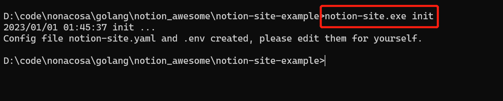
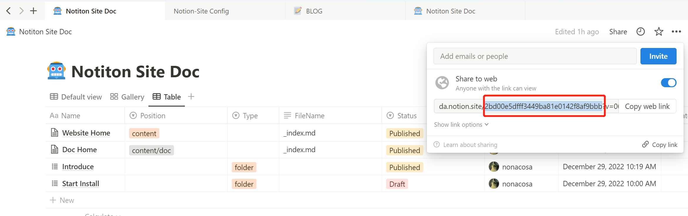

在实际生成网站之前我们也可以在本地进行 debug 测试，测试生成的网站是否正确。

### 下载或安装 Notion-Site 离线程序
<!--more-->1： 在 **[release 下载页](https://github.com/pkwenda/notion-site/releases)** 选择当前操作系统最新的 release 二进制包。

2： 基于 **Unix 平台** 可以在线安装：


 ```powershell
 curl -sSf https://raw.githubusercontent.com/pkwenda/notion-site/master/install.sh | sh
 ```
 

### 生成配置文件：
在 windows 中：


 ```powershell
 notion-site.exe init
 ```
 


在 Unix 系统中：


 ```powershell
 notion-site init
 ```
 生成如下文件：

notion-site.yaml


 ```yaml
 notion:
    databaseId: YOUR-NOTION-DATABASE-ID
    filterProp: Status
    filterValue:
        - Finished
        - Published
    publishedValue: Published
markdown:
  homePath: ""
 ```
 我们需要更改：

- homePath: 为执行命令时 hugo 目录的相对路径

- databaseId 换为 复制模板后自己 workspace 页面的 page id：



.env


 ```yaml
 NOTION_SECRET=xxxx
 ```
 - Notion_SECRET 填写之前我们创建的 Integration 的 Token


### 下载 Hugo 模板
参考之前文档：xxxxxxxxxxx，我们还以 xx 为例，下载到本地，将


